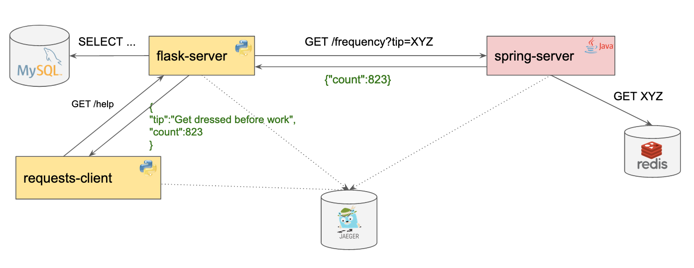

# OpenTelemetry Auto-Instrumentation Deep Dive example

*More information about the session can be found [here](https://sched.co/Zein)*

## Prerequisites
### docker-compose
* Docker
* docker-compose

## Using docker-compose
Run the following commands

```bash
git clone git@github.com:lightstep/kubecon-otel-auto-instrumentation.git && cd kubecon-otel-auto-instrumentation
docker-compose build
docker-compose up
```

This will launch all the services in the local Docker environment. Each service exposes ports for its services to the local host:

* jaeger can be accessed via http://localhost:16686
* spring-server can be accessed via http://localhost:8082/frequency
* flask-server can be accessed via http://localhost:8080/help


## Service Architecture

The purpose of the applications in this repo is to demonstrate the use of auto-instrumentation to trace requests through a system. The system is composed of three different components, a client and two server applications. The flow of requests is represented in the following diagram:

